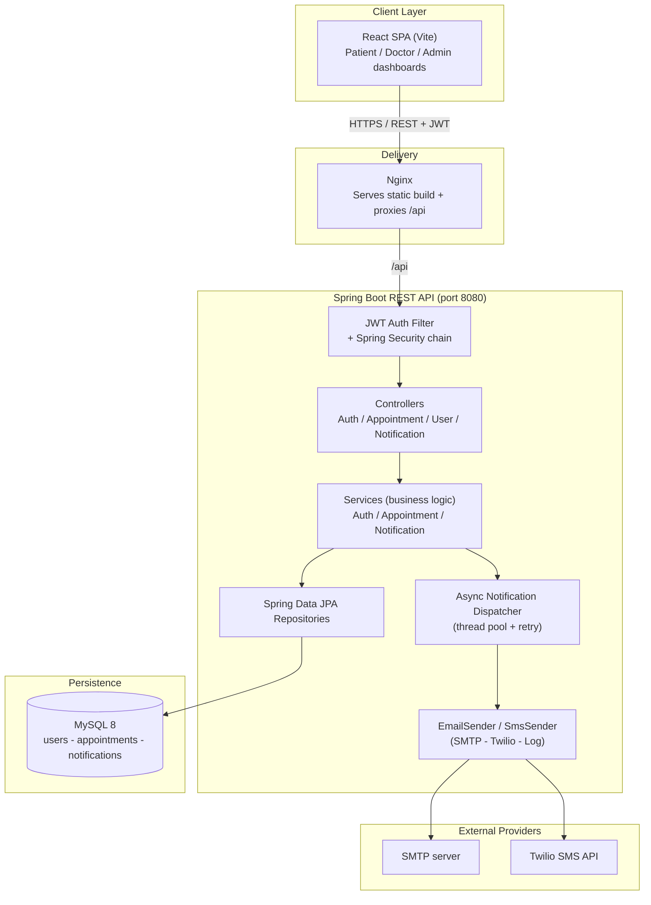
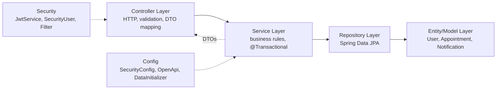
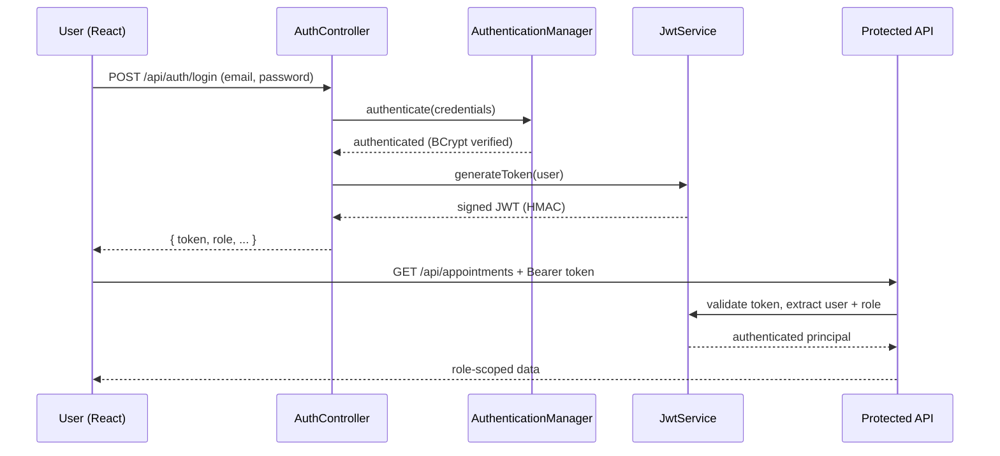
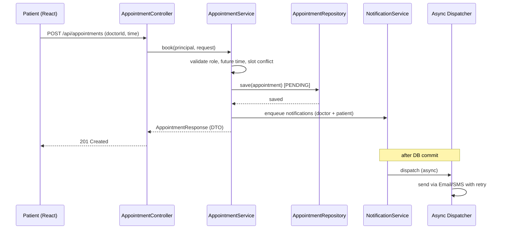
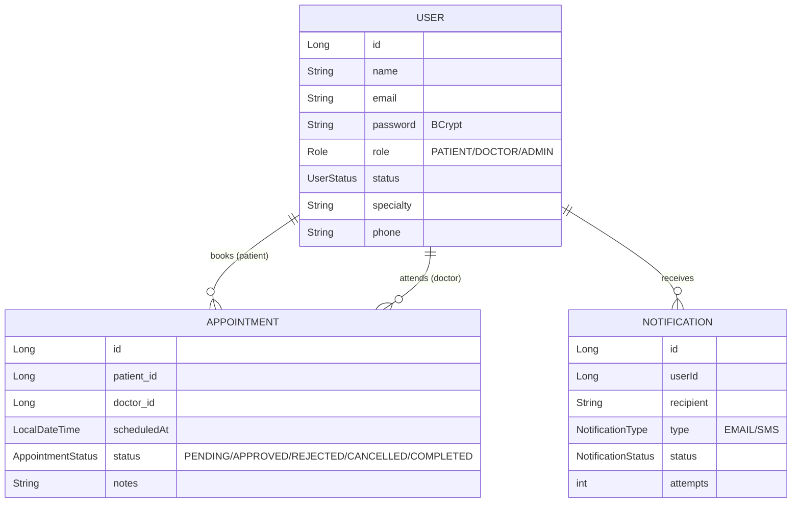

# Helios (HelloDoctor) — Architecture

A secure, full-stack healthcare appointment system: a stateless Spring Boot REST API with
JWT auth and role-based access control, a React (Vite) single-page app, MySQL persistence,
and asynchronous email/SMS notifications — all containerized with Docker Compose.

---

## 1. High-level system architecture

---

## 2. Layered (clean) architecture inside the backend

Each layer has a single responsibility and only talks to the layer directly below it
(Controller → Service → Repository → Entity). This is the classic **layered / n-tier** pattern.

---

## 3. Authentication flow (JWT)

---

## 4. Appointment booking flow (with async notifications)

---

## 5. Domain model

---

## 6. Tools & technologies

| Area | Technology | Why it's used |
|------|-----------|----------------|
| Language | Java 21 | LTS; records, switch expressions, sealed types |
| Framework | Spring Boot 3.4 | Auto-configuration, embedded Tomcat, production starters |
| Web | Spring MVC (REST) | Stateless JSON REST endpoints |
| Security | Spring Security + JWT (jjwt) | Stateless auth, role-based access control |
| Passwords | BCrypt | Salted one-way hashing |
| Data access | Spring Data JPA / Hibernate | ORM, repositories, `JOIN FETCH` for eager loading |
| Database | MySQL 8 | Relational integrity for users and appointments |
| Validation | Jakarta Bean Validation | `@Valid` request DTOs at the API boundary |
| Notifications | Spring `@Async` + JavaMailSender + Twilio REST | Non-blocking email/SMS with retry; pluggable |
| API docs | springdoc OpenAPI / Swagger UI | Self-documenting, JWT-aware API explorer |
| Monitoring | Spring Boot Actuator | Health/info endpoints |
| Frontend | React 18 + Vite | Component SPA with fast tooling |
| Routing/HTTP | React Router + Axios | Client routing; Axios interceptor attaches JWT |
| Build | Maven (backend), npm (frontend) | Dependency management, reproducible builds |
| Testing | JUnit 5 + Spring Test + MockMvc + H2 | Unit + integration tests on in-memory DB |
| Containerization | Docker + Docker Compose | One-command spin-up of db + backend + frontend |
| Web server | Nginx | Serves the SPA, reverse-proxies `/api` |

---

## 7. Key design decisions

- **Stateless JWT auth** — no server-side sessions, so the API scales horizontally. The token
  carries the user id + role; every request is independently authenticated by a filter.
- **Role-Based Access Control (RBAC)** — three roles enforced at the URL level (`SecurityConfig`)
  and method level. Only PATIENT can book, only ADMIN can list users. Self-registration cannot
  create an ADMIN (privilege-escalation guard).
- **Layered architecture + DTOs** — entities never leak to the API; responses use dedicated DTO
  records. Mapping happens inside the transaction (or via `JOIN FETCH`) to avoid
  `LazyInitializationException` with `open-in-view=false`.
- **Asynchronous notifications** — appointment events enqueue notifications delivered on a
  background thread pool with **retry**, firing only **after the DB transaction commits** (no race
  conditions). Providers are pluggable: log (dev), SMTP, or Twilio via config.
- **Externalized configuration** — all secrets/URLs come from environment variables (12-factor),
  so the same image runs in dev and prod.
- **Security hygiene** — BCrypt hashing, CORS restricted to known origins, CSRF disabled (safe for
  a stateless token API), and error responses never expose stack traces.
- **Testability** — integration tests run against in-memory H2 in MySQL mode, with
  `open-in-view=false` to catch persistence bugs early.

---

## 8. Request/response summary

| Endpoint | Method | Auth | Description |
|----------|--------|------|-------------|
| `/api/auth/register` | POST | Public | Register (PATIENT/DOCTOR) |
| `/api/auth/login` | POST | Public | Login, returns JWT |
| `/api/doctors` | GET | Authenticated | List doctors |
| `/api/appointments` | GET | JWT | List appointments (role-based) |
| `/api/appointments` | POST | PATIENT | Book appointment |
| `/api/appointments/{id}` | PUT | DOCTOR/ADMIN | Approve/reject/update |
| `/api/appointments/{id}` | DELETE | PATIENT/ADMIN | Cancel appointment |
| `/api/users` | GET | ADMIN | List users |
| `/api/users/{id}/status` | PUT | ADMIN | Enable/disable a user |
| `/api/notifications` | POST | DOCTOR/ADMIN | Send a notification (async) |
| `/api/notifications` | GET | JWT | List your notifications |

---

## 9. Elevator pitch

> Helios is a full-stack healthcare appointment system. The backend is a stateless Spring Boot
> REST API secured with JWT and role-based access control, backed by MySQL through Spring Data
> JPA. It follows a clean layered architecture — controllers, services, repositories — with DTOs
> at the boundary. Appointment events trigger asynchronous email/SMS notifications with retry
> through pluggable providers. The React + Vite frontend consumes the API with Axios, and the
> whole stack — database, backend, and Nginx-served frontend — runs with a single
> `docker compose up`. It's documented with Swagger and covered by JUnit/MockMvc integration tests.
